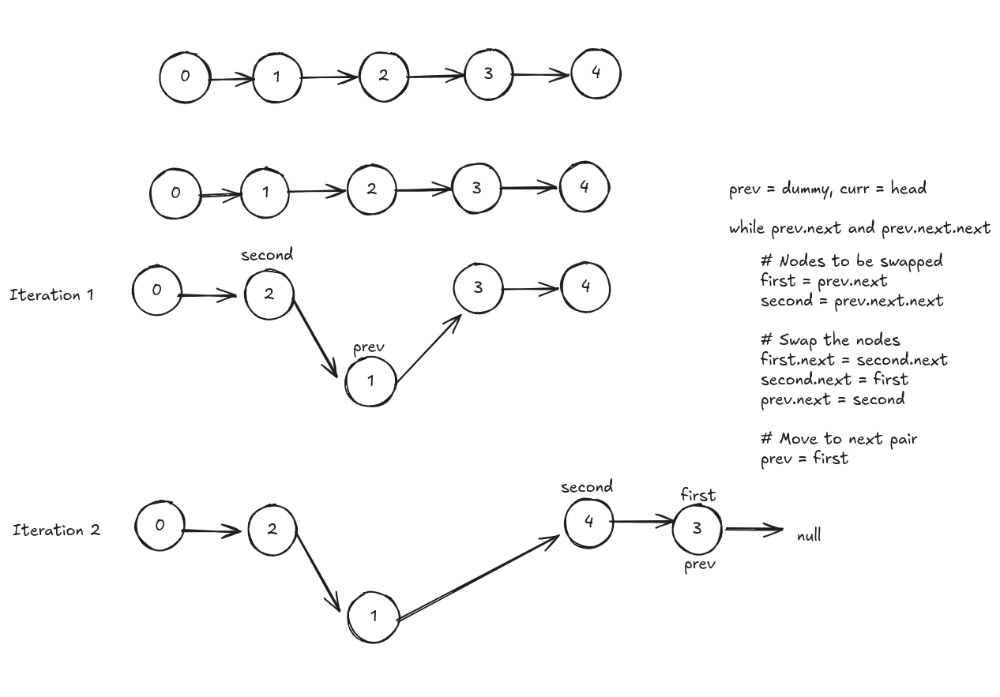

# LinkedList In-place Reversal

The In-place Reversal of a LinkedList pattern reverses parts of a linked list without using extra space.

## Reverse Linked List I

[https://leetcode.com/reverse-linked-list](https://leetcode.com/problems/reverse-linked-list/description/)

Easy

```java
/**
 * Definition for singly-linked list.
 * public class ListNode {
 *     int val;
 *     ListNode next;
 *     ListNode() {}
 *     ListNode(int val) { this.val = val; }
 *     ListNode(int val, ListNode next) { this.val = val; this.next = next; }
 * }
 */
class Solution {
    public ListNode reverseList(ListNode head) {
        
        ListNode prev = null;
        ListNode current = head;

        while(current != null) {
            ListNode temp = current.next; // Store next node

            current.next = prev; // Reverse the link
            prev = current; // Move prev forward
            current = temp; // Move current forward
        }

        return prev;
    }
}
```

## Reverse Linked list II

[https://leetcode.com/reverse-linked-list-ii/](https://leetcode.com/problems/reverse-linked-list-ii/)

MEDIUM

PENDING

[Deep Seek](https://chat.deepseek.com/a/chat/s/d7cf9e16-04b2-49b9-8f44-d314a2827332)

## Swap Nodes in Pairs

[https://leetcode.com/swap-nodes-in-pairs](https://leetcode.com/problems/swap-nodes-in-pairs/description/)

Medium

```java
/**
 * Definition for singly-linked list.
 * public class ListNode {
 *     int val;
 *     ListNode next;
 *     ListNode() {}
 *     ListNode(int val) { this.val = val; }
 *     ListNode(int val, ListNode next) { this.val = val; this.next = next; }
 * }
 */
class Solution {
    public ListNode swapPairs(ListNode head) {

        ListNode dummy = new ListNode(0, head);

        ListNode prev = dummy;

        while(prev.next != null && prev.next.next != null) {
            ListNode first = prev.next;
            ListNode second = prev.next.next;

            // swap
            first.next = second.next;
            second.next = first;
            prev.next = second;

            // move to next pair
            prev = first;

        }

        return dummy.next;
    }
}
```



[DeepSeek link](https://chat.deepseek.com/a/chat/s/72db358a-2d15-4291-9e69-af592c87ef3c)
