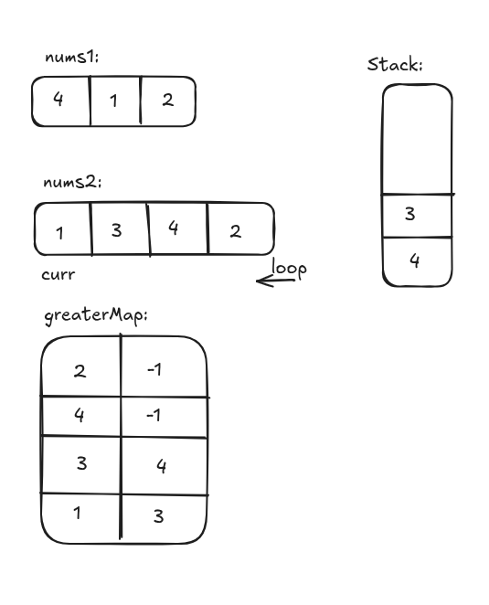

# Monotonic Stack

## Next Greater Element I

[https://leetcode.comnext-greater-element-i](https://leetcode.com/problems/next-greater-element-i/description/)

Easy

```java
class Solution {
    public int[] nextGreaterElement(int[] nums1, int[] nums2) {

        Map<Integer, Integer> greateMap = new HashMap<>();
        Stack<Integer> stack = new Stack<>();

        for(int i=nums2.length-1; i >= 0; i--) {
            int curr = nums2[i];

            while(!stack.isEmpty() && curr >= stack.peek()) {
                stack.pop();
            }

            if(stack.isEmpty()) {
                greateMap.put(curr, -1);
            } else {
                greateMap.put(curr, stack.peek());
            }

            stack.push(curr);
        }

        int res[] = new int[nums1.length];
        for(int i=0; i<nums1.length; i++) {
            res[i] = greateMap.get(nums1[i]);
        }

        return res;

    }
}
```

[DeepSeek Link](https://chat.deepseek.com/a/chat/s/f28d68bf-6a42-4454-973f-224adef38dcf)




## Daily Temperatures

[https://leetcode.com/daily-temperatures](https://leetcode.com/problems/daily-temperatures/description/)

Medium

```java
class Solution {
    public int[] dailyTemperatures(int[] temperatures) {
        int n = temperatures.length;
        int[] ans = new int[n];
        Stack<Integer> stack = new Stack<>(); // Store indices, not values
        
        for (int i = 0; i < n; i++) {
            // While current temperature is warmer than temperature at stack top index
            while (!stack.isEmpty() && temperatures[i] > temperatures[stack.peek()]) {
                int prevIndex = stack.pop();
                ans[prevIndex] = i - prevIndex; // Calculate days difference
            }
            stack.push(i);
        }
        
        // Remaining indices in stack automatically have ans[i] = 0
        return ans;
    }
}
```

[DeepSeek link](https://chat.deepseek.com/a/chat/s/c115b26b-e2b5-4b6c-a1d1-7e4ff13509f8)
